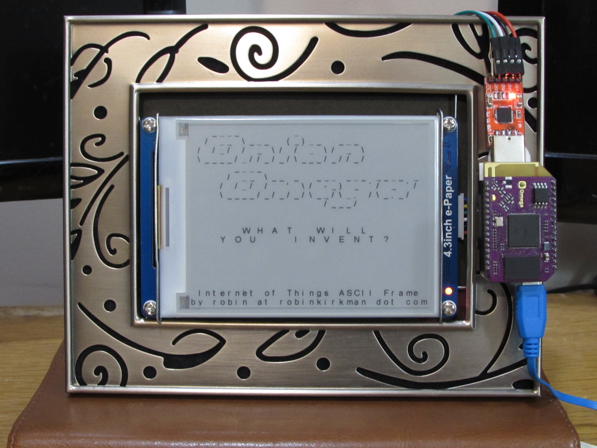

# Pictureframe of Things

*internet-accessible (and -updateable) e-paper display, powered by
[Onion Omega](https://onion.io/), and mounted in a classy frame*

## parts required

* [Onion Omega](https://onion.io/product/omega/)
  -- *Primary IoT controller device*
* [Mini Dock](https://onion.io/product/mini-dock/)
  -- *Power and USB connectivity*
* [Waveshare 4.3" e-Paper display](https://www.amazon.com/gp/product/B00VV5IMN0/)
  -- *Fancy e-Paper display with serial control interface*
* [CP2102 USB to TTL serial adapter](https://www.amazon.com/dp/B00LODGRV8/)
  -- *USB serial port to control the display*
* A classy picture frame, plastic foam, and tape for mounting
  -- *Because being classy matters*

## additional requirements

If you want to expose your Pictureframe-of-Things to the public
internet, you'll need a server somewhere that can proxy requests back
to the Onion Omega.  In my case, my Onion Omega makes an ssh tunnel to a
dedicated server, which uses name-based virtual hosting to proxy all
requests for [www.pictureframeofthings.com](http://www.pictureframeofthings.com/)
back to the Onion Omega's lighttpd server.

If you don't care about exposing it to the internet, it will still be
available for updates on your LAN, as well as over the Onion Omega's
built in wifi access point.
